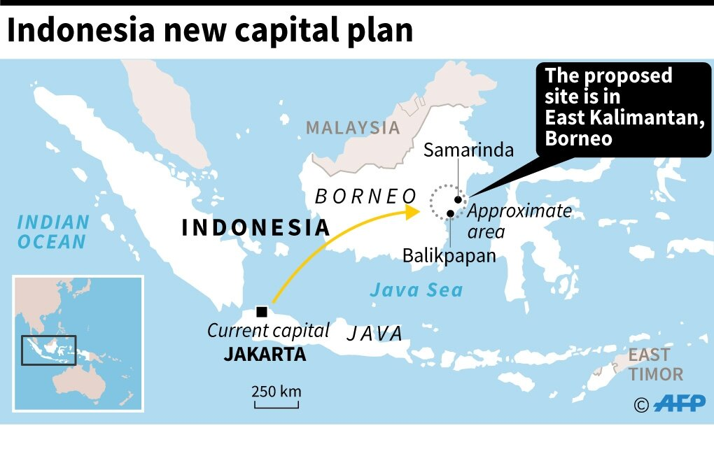

```{r setup, include=FALSE}
knitr::opts_chunk$set(echo = FALSE)
```

## Our Team

> Pictures and information about our team members

## East Kalimantan and the need for change


Jakarta, the current capital, has been sinking over 10cm a year and is now prone to floods more than ever. It is prone to earthquakes and traffic gridlocks within the city have long been an issue.

As such, the Indonesian government has decided to shift its capital and has picked East Kalimantan, on the island of Borneo, as the new site. The exact location is still unknown but it is currently nicknamed “Ibu Kota Negara” which directly translates to “New Capital”.

hi 
